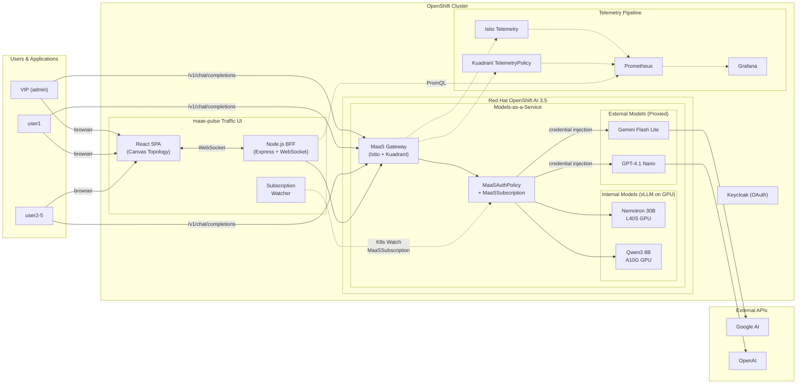
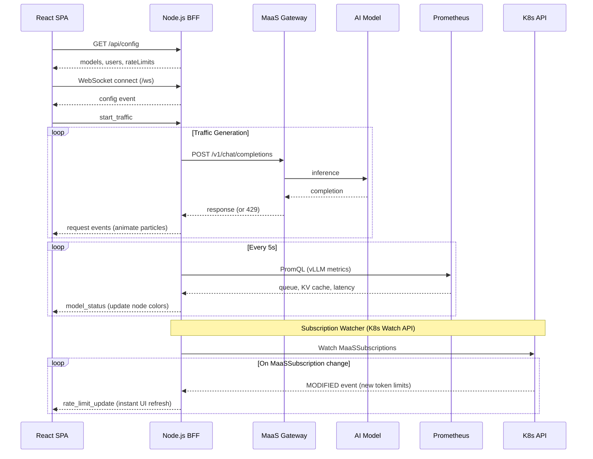

# Real-time AI traffic observability with MaaS on OpenShift AI

Visualize and monitor live inference traffic across multiple AI models served through Red Hat OpenShift AI Models-as-a-Service.

## Table of Contents

- [Overview](#overview)
- [Detailed description](#detailed-description)
  - [See it in action](#see-it-in-action)
  - [Architecture diagrams](#architecture-diagrams)
- [Requirements](#requirements)
  - [Minimum hardware requirements](#minimum-hardware-requirements)
  - [Minimum software requirements](#minimum-software-requirements)
  - [Required user permissions](#required-user-permissions)
- [Deploy](#deploy)
  - [Prerequisites](#prerequisites)
  - [Installation](#installation)
  - [Validating the deployment](#validating-the-deployment)
  - [Delete](#delete)
- [Repository structure](#repository-structure)
- [References](#references)
- [Technical details](#technical-details)
- [Tags](#tags)

## Overview

maas-pulse deploys a multi-model MaaS environment on OpenShift AI 3.5 with built-in observability. It provisions internal models (served via vLLM with GPU acceleration) and external model proxies (e.g., Google Gemini) behind a unified MaaS gateway, then exports per-subscription metrics to enable real-time traffic visualization and usage attribution.

## Detailed description

Organizations adopting AI need visibility into how their models are being consumed: which teams use which models, how much capacity is being utilized, and where latency bottlenecks occur. maas-pulse addresses this by combining OpenShift AI's Models-as-a-Service infrastructure with a telemetry pipeline that captures per-user, per-model, and per-subscription metrics.

The deployment includes two internal models (NVIDIA Nemotron 3 Nano 30B and Qwen3-8B) served via vLLM on dedicated GPUs, plus external models (Google Gemini 3.1 Flash Lite and OpenAI GPT-4.1 Nano) proxied through the MaaS inference gateway with automatic credential injection. Multi-tenant access control is managed through MaaSSubscription and MaaSAuthPolicy resources, with Keycloak providing user authentication via OpenShift OAuth.

Istio Telemetry and Kuadrant TelemetryPolicy capture request-level metrics (latency, model, user, subscription, organization) and export them to Prometheus. A Grafana instance (deployed separately) can query these metrics to build dashboards for usage attribution, cost center tracking, and performance monitoring.

A custom web UI (maas-pulse Traffic UI) provides real-time traffic flow visualization: a canvas-rendered topology shows users, the MaaS gateway, and models as an animated network graph, with colored particles representing live inference requests flowing through the system. The UI displays per-user rate limits (dynamically updated via K8s Watch on MaaSSubscription CRs), rate-limit blocking status, and per-model health metrics (queue depth, KV cache utilization, p95 latency) — all updated in real-time via WebSocket. Rate limit changes made in the RHOAI console are reflected in the UI within seconds, without requiring a page refresh or redeployment.

### See it in action

> **WIP**: Screenshots and a walkthrough video will be added soon. The traffic UI is deployed and functional — see [Architecture diagrams](#architecture-diagrams) below for how it works.

### Architecture diagrams

**System architecture** — shows how users, the MaaS gateway, internal/external models, telemetry pipeline, and the traffic UI fit together:



> Source: [`docs/images/architecture.mmd`](docs/images/architecture.mmd)

**Traffic UI data flow** — shows the real-time request lifecycle from browser control to model inference and back:



> Source: [`docs/images/traffic-ui-flow.mmd`](docs/images/traffic-ui-flow.mmd)

## Requirements

### Minimum hardware requirements

**Internal models (GPU required):**

| Model | GPU | CPU | Memory |
|---|---|---|---|
| NVIDIA Nemotron 3 Nano 30B A3B FP8 | 1x NVIDIA L40S | 2 (req) / 4 (limit) | 16Gi (req) / 24Gi (limit) |
| Qwen3-8B FP8 Dynamic | 1x NVIDIA A10G | 2 (req) / 4 (limit) | 12Gi (req) / 20Gi (limit) |

**Platform components** (no GPU required):
- MaaS gateway, Keycloak, PostgreSQL, monitoring stack: ~4 vCPU, ~8Gi memory total
- Persistent storage: ~50Gi (Prometheus retention + Grafana + PostgreSQL)

> **Note**: If using only external models (e.g., Gemini), no GPU is required.

### Minimum software requirements

- OpenShift Container Platform 4.19+
- Red Hat OpenShift AI 3.5 (operator `rhods-operator.3.5.0`)
- Helm CLI 3.12+
- `oc` CLI 4.14+

The following operators are installed automatically by the `dependency-operators` chart:
- Red Hat OpenShift AI (RHOAI 3.5)
- Red Hat Connectivity Link (RHCL / Kuadrant)
- cert-manager Operator
- LeaderWorkerSet Operator
- CloudNativePG
- Red Hat Build of Keycloak (RHBK)
- Cluster Observability Operator
- Red Hat OpenTelemetry

### Required user permissions

Cluster admin access is required because this deployment:
- Installs cluster-scoped operators (RHOAI, Kuadrant, cert-manager)
- Creates a DataScienceCluster and Gateway resources
- Configures cluster monitoring (user-workload monitoring)
- Creates cross-namespace resources (Keycloak OAuth integration)

## Deploy

### Prerequisites

Before deploying, ensure you have:
- Access to a Red Hat OpenShift cluster with the requirements above
- `oc` CLI installed and authenticated as cluster admin (`oc whoami` should return an admin user)
- `helm` CLI (3.12+) installed
- A default StorageClass configured on the cluster
- (Optional) A Google Gemini API key and/or OpenAI API key for external models

### Installation

**Option A: All-in-one script (recommended)**

The `all-in-one.sh` script handles environment detection, operator installation, and chart deployment:

```bash
git clone https://github.com/YOUR_ORG/maas-pulse.git
cd maas-pulse
./all-in-one.sh
```

The script will:
1. Detect your cluster's ingress domain and certificate configuration
2. Prompt for admin and user passwords (stored in `.env`, gitignored)
3. Prompt for an optional Google Gemini API key (if provided, deploys the external model; if skipped, only internal models are deployed)
4. Install all dependency operators and wait for RHOAI to be ready
5. Deploy the maas-pulse chart with Keycloak, monitoring, and models

**Option B: Step-by-step with Helm**

1. Install dependency operators:
```bash
helm upgrade --install dependency-operators charts/dependency-operators \
  -f environment.yaml
oc wait --for=condition=Ready datasciencecluster default-dsc --timeout 15m0s
```

2. Deploy the maas-pulse chart:
```bash
helm upgrade --install maas-pulse charts/maas-pulse \
  -n default --timeout 20m0s \
  -f charts/maas-pulse/all-dependencies.yaml \
  -f environment.yaml \
  --set keycloak.realm.admin.password="YOUR_ADMIN_PASSWORD" \
  --set keycloak.realm.user.password="YOUR_USER_PASSWORD"
```

To include external models with real API keys:
```bash
  --set externalModels[0].apiKey="YOUR_GEMINI_API_KEY" \
  --set externalModels[1].apiKey="YOUR_OPENAI_API_KEY"
```

### Validating the deployment

1. Check all models are registered and ready:
```bash
oc get llminferenceservice -n llm
oc get maasmodelref -n llm
```
All entries should show `READY: True` or `PHASE: Ready`.

2. Verify the MaaS gateway is accessible:
```bash
MAAS_URL=$(oc get maasmodelref -n llm -o jsonpath='{.items[0].status.endpoint}' | sed 's|/llm/.*||')
echo $MAAS_URL
```

3. Test model inference (requires a MaaS API key from the Gen AI Studio dashboard):
```bash
curl -s "$MAAS_URL/v1/chat/completions" \
  -H "Authorization: Bearer YOUR_MAAS_API_KEY" \
  -H "Content-Type: application/json" \
  -d '{"model": "qwen3-8b-fp8", "messages": [{"role": "user", "content": "Say hello in one word."}], "max_tokens": 10}'
```

### Delete

To completely remove the deployment:

1. Uninstall the maas-pulse chart:
```bash
helm uninstall maas-pulse -n default
```

2. (Optional) Uninstall dependency operators:
```bash
helm uninstall dependency-operators
```

3. (Optional) Delete the model namespace and related resources:
```bash
oc delete namespace llm
```

> **Note**: Uninstalling the dependency-operators chart does not remove the operators themselves (OLM subscriptions persist). To fully remove operators, delete the subscriptions and CSVs manually.

## Repository structure

```
.
├── all-in-one.sh                          # End-to-end deployment script
├── environment.yaml.tpl                   # Cluster-specific values template
├── app/                                   # maas-pulse Traffic UI application
│   ├── client/                            #   React SPA (Vite + Canvas topology)
│   └── server/                            #   Node.js BFF (Express + WebSocket + K8s Watch)
├── charts/
│   ├── dependency-operators/              # Helm chart: operators + operands
│   │   ├── charts/install-operators/      #   Sub-chart for OLM subscriptions
│   │   ├── files/                         #   Scripts for DSC, Kuadrant, LWS creation
│   │   └── values.yaml                    #   Operator channels, versions, namespaces
│   └── maas-pulse/                        # Helm chart: models + auth + telemetry
│       ├── charts/keycloak/               #   Sub-chart for Keycloak + OAuth
│       ├── templates/models/              #   LLMInferenceService, ExternalProvider,
│       │                                  #   ExternalModel, MaaSModelRef, etc.
│       ├── templates/telemetry*.yaml      #   Istio + Kuadrant telemetry config
│       ├── all-dependencies.yaml          #   Enables Keycloak, monitoring, Kuadrant
│       └── values.yaml                    #   Models, subscriptions, rate limits
├── docs/
│   ├── examples/grafana.yaml              # Grafana deployment with OAuth + Prometheus
│   ├── images/                            # Architecture diagrams (Mermaid)
│   │   ├── architecture.mmd              #   System architecture diagram
│   │   └── traffic-ui-flow.mmd           #   Traffic UI sequence diagram
│   └── reference/test-model-access.yaml   # Standalone model endpoint test pod
└── README.md
```

## References

- [Red Hat OpenShift AI 3.5 Documentation](https://docs.redhat.com/en/documentation/red_hat_openshift_ai_self-managed/3.5)
- [RHOAI 3.5 Release Notes](https://docs.redhat.com/en/documentation/red_hat_openshift_ai_self-managed/3.5/html-single/release_notes/index)
- [RHOAI Supported Configurations](https://access.redhat.com/articles/rhoai-supported-configs-3.x)
- [Automating RHOAI installations with Helm and GitOps](https://developers.redhat.com/articles/2026/08/26/automating-red-hat-openshift-ai-installations-with-helm-and-gitops)

## Technical details

### Models-as-a-Service architecture

MaaS provides an OpenAI-compatible API gateway for model inference:
- **Endpoint**: `/v1/chat/completions` with body-based model routing (`"model"` field selects the target)
- **Auth**: `Authorization: Bearer sk-oai-...` (API keys issued via Gen AI Studio or REST API)
- **Internal models**: Served via vLLM with modelcar-format OCI images, registered through `MaaSModelRef`
- **External models**: Proxied through `ExternalProvider` + `ExternalModel` CRs (`inference.opendatahub.io/v1alpha1`) with automatic credential injection

### Telemetry pipeline

- **Istio Telemetry** (`telemetry.yaml`): Captures `REQUEST_DURATION` with subscription label from `x-maas-subscription` header
- **Kuadrant TelemetryPolicy** (`telemetrypolicy.yaml`): Extracts model name from response body, user/subscription/org from auth identity
- **Prometheus**: Metrics scraped via user-workload monitoring, queryable through Thanos Querier
- **Grafana** (`docs/examples/grafana.yaml`): Example deployment with OAuth proxy and Prometheus datasource

### vLLM configuration

| Model | Parser | Max context | GPU | Node selector |
|---|---|---|---|---|
| Nemotron 3 Nano 30B | `qwen3_coder` + custom reasoning parser | 131072 | L40S | `nvidia.com/gpu.product: NVIDIA-L40S` |
| Qwen3-8B | `hermes` | 40960 | A10G | `nvidia.com/gpu.product: NVIDIA-A10G` |

Both models use GPU taints (`nvidia.com/gpu=:NoSchedule`) to isolate inference workloads.

### Known operational notes

- **GPU deadlock on updates**: With `RollingUpdate` strategy and a single GPU, new pods cannot schedule until the old pod is manually deleted to release the GPU.
- **External model TLS**: If `maas.opendatahub.io/tls` annotation is set to `false` while a `credentialRef` exists, provider API keys are sent in plain text.

## Tags

**Title:** Real-time AI traffic observability with MaaS on OpenShift AI
**Description:** Visualize and monitor live inference traffic across multiple AI models served through Red Hat OpenShift AI Models-as-a-Service
**Industry:** Cross-industry
**Product:** OpenShift AI
**Use case:** Observability, AI operations
**Partner:** N/A
**Contributor org:** Red Hat
